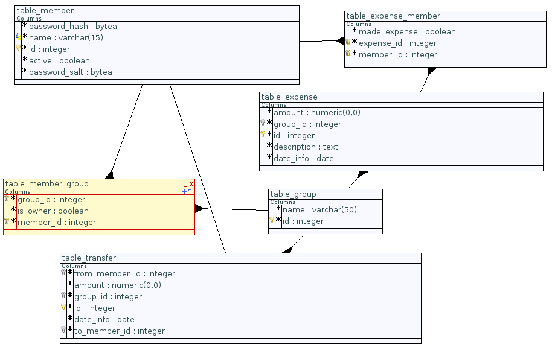

*********************
Database architecture
*********************

A few words about the database

Tables and relations
====================

==================== ===========
Tables               Description
==================== ===========
table_member         Contains information relevent to users
table_group          Holds the various groups of members
table_member_group   Links members to groups (many-to-many relationship)
table_expense        Contains all expenses
table_expense_member Links expenses to members (many-to-many relationship)
table_transfer	     Contains all money transfers between members
==================== ===========

Constraints
===========

Besides the uniqueness and foreign key constraints inherent to the table definitions,
a few triggers are defined to ensure the following points:

* the members linked to expenses and transfers belong to the group of the expense/transfer
* an expense has one and only maker
* a group has one and only one owner

Stored procedures
=================

sub-section
+++++++++++

Bla bla

.. code-block:: none

        Bla bla

SQL source code
===============

Table definitions
-----------------

.. literalinclude:: ../../xpensemate/db/model-postgres/db_structure.sql

Triggers
--------

.. literalinclude:: ../../xpensemate/db/model-postgres/db_triggers.sql

Stored procedures
-----------------

.. literalinclude:: ../../xpensemate/db/model-postgres/db_functions.sql
